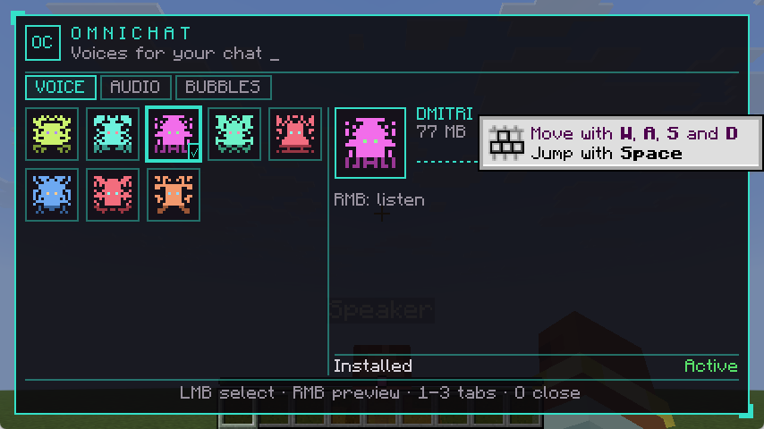

# OmniChat

Fabric мод для Minecraft, добавляющий голосовую озвучку чата (TTS) с пространственным звуком и визуальные облачка сообщений над головами игроков.

## Возможности

- **Text-to-Speech** — сообщения в чате автоматически озвучиваются
- **Пространственный звук** — голос идёт из позиции игрока-отправителя, громкость зависит от расстояния
- **Несколько TTS-движков** — sherpa-onnx (VITS, мультиспикер) и GLaDOS (TeraTTS g2p-vits)
- **Облачка чата** — текст сообщений отображается над головой игрока с плавным появлением и переносом по словам
- **Индикатор набора** — анимированные точки `...` над головой игрока, когда он печатает в чат
- **Выбор голоса** — каждый игрок может выбрать себе модель и голос, настройки сохраняются на сервере
- **Раздача моделей** — сервер сообщает клиентам список своих TTS-моделей; недостающие скачиваются кнопками Download / Download All в экране настроек
- **Экран настроек** — переключение TTS, громкость, скорость речи, выбор модели, облачка чата



## Требования

- Minecraft **1.21.11**
- Fabric Loader **0.18.4+**
- Fabric API
- Java **21+**

## Установка

1. Установите [Fabric Loader](https://fabricmc.net/use/installer/) для Minecraft 1.21.11
2. Скачайте [Fabric API](https://modrinth.com/mod/fabric-api) и поместите в папку `mods/`
3. Скачайте JAR мода из [Releases](https://github.com/Shura4eburek/OmniChat/releases) и поместите в папку `mods/`
4. Поместите TTS-модели в `config/omnichat/models/<имя_модели>/` — набор файлов зависит от типа модели, см. [TTS-модели](#tts-модели)

### Установка на сервер

Выбор голоса, его синхронизация между игроками и раздача моделей работают только если мод (и Fabric API) стоит **и на сервере**:

1. Поместите JAR мода и Fabric API в `mods/` сервера
2. Положите модели в `<папка_сервера>/config/omnichat/models/<имя_модели>/` — та же структура, что и на клиенте. Сервер не синтезирует речь: модели нужны ему только чтобы показать список игрокам и раздать недостающие файлы клиентам
3. Выбранные игроками голоса хранятся в `<папка_сервера>/config/omnichat/`

Список моделей сканируется при старте сервера. После добавления или удаления модели выполните **`/omnichat reload`** (нужны права оператора, уровень 2): сервер пересканирует папку и разошлёт обновлённый список всем игрокам онлайн, рестарт не нужен. Голоса игроков, чья модель удалена, перестают применяться (сохранённый выбор возвращается, если модель снова появится). Если выбор голоса отклонён (модели нет на сервере), игрок получает сообщение в чат.

### Оформление голосов

В папку модели можно положить два необязательных файла: тогда в меню OmniChat у голоса будут имя, описание и портрет.

`voice.json`:

```json
{ "name": "Денис", "description": "Спокойный мужской голос", "language": "ru",
  "gender": "male", "sample": "Привет, я Денис." }
```

| Поле | Лимит | Назначение |
|---|---|---|
| `name` | 32 символа | Имя в меню |
| `description` | 200 | Описание в карточке |
| `language` | 8 | Код языка, показывается рядом с размером |
| `gender` | 16 | Свободное поле |
| `sample` | 120 | Фраза для прослушивания (ПКМ по голосу) |

`portrait.png` — PNG 16×16 или 32×32, не больше 8 КБ. Если портрета нет, мод нарисует его сам по имени модели.

Сервер раздаёт эти данные всем игрокам вместе со списком голосов, поэтому оформление видно даже у ещё не скачанных моделей. После изменения файлов выполни `/omnichat reload`.

## TTS-модели

Мод поддерживает два типа моделей:

| Тип | Определение | Формат |
|-----|-------------|--------|
| **sherpa-onnx VITS** | Нет `dictionary.txt` в папке модели | `.onnx` + `tokens.txt` |
| **GLaDOS (TeraTTS)** | Есть `dictionary.txt` в папке модели | `.onnx` + `config.json` + `dictionary.txt` |

Тип определяется автоматически по наличию файла `dictionary.txt`. Папка, в которой не хватает обязательных для её типа файлов, не попадает в список моделей (в лог пишется предупреждение со списком недостающих файлов).

**Выбор `.onnx`-файла:** если в папке есть `model.onnx`, используется он; иначе — единственный `.onnx` в папке. Если `.onnx`-файлов несколько и среди них нет `model.onnx`, модель не загружается (в ошибке перечислены кандидаты) — переименуйте нужный файл в `model.onnx` или удалите лишние. Выбранный файл пишется в лог.

**sherpa-onnx VITS:**
- `.onnx` должен содержать метаданные sherpa-onnx (в частности `n_speakers`). Обычные экспорты Piper без этих метаданных отклоняются с ошибкой «not a compatible VITS model» — используйте модели, подготовленные для sherpa-onnx (с добавленными метаданными).
- `tokens.txt` — таблица токенов модели.
- `espeak-ng-data/` — необязательно; нужна моделям на espeak-фонемах (Piper). Если папка есть, в ней должен быть файл `phontab`, иначе загрузка прерывается с ошибкой. Если модели espeak не нужен, удалите неполную папку.

**GLaDOS (TeraTTS):**
- `config.json` — обязательно `phoneme_id_map`. Частота дискретизации берётся из `audio.sample_rate` (формат Piper) или `model_config.samplerate` (формат TeraTTS), по умолчанию 22050 Гц. Параметры инференса — из `inference.noise_scale`, `inference.length_scale`, `inference.noise_w` (по умолчанию 0.667 / 1.0 / 0.8).
- `dictionary.txt` — словарь произношений: `слово фонема фонема …` по одной записи на строку.
- Сообщения, в которых не нашлось ни одной известной модели фонемы (например, другой алфавит), пропускаются без синтеза.

**Поддержка платформ:** нативные библиотеки sherpa-onnx в мод включены только для **Windows x64**, поэтому VITS-модели сейчас работают только там. На Linux и macOS такие модели недоступны (TTS для них отключается с ошибкой в логе, игра не падает). GLaDOS-модели используют ONNX Runtime из Maven и работают на всех платформах (Windows x64, Linux x64/arm64, macOS x64/arm64).

## Сборка из исходников

```bash
git clone https://github.com/Shura4eburek/OmniChat.git
cd OmniChat
./gradlew build
```

Собранный JAR будет в `build/libs/`.

## Горячие клавиши

Настройки мода доступны через меню управления клавишами Minecraft (раздел OmniChat).

## Конфигурация

Файл конфигурации: `config/omnichat/config.json`. Значения вне допустимых диапазонов (и пустой `modelPath`) исправляются при загрузке, исправленный конфиг сохраняется обратно.

| Параметр | Тип | По умолчанию | Описание |
|----------|-----|--------------|----------|
| `enabled` | boolean | `true` | Включить/выключить TTS |
| `volume` | float | `1.0` | Громкость озвучки, 0.0–2.0 (выше 1.0 возможен клиппинг) |
| `speed` | float | `1.0` | Скорость речи, 0.5–2.0 |
| `modelPath` | string | `"default"` | Имя папки модели в `config/omnichat/models/` |
| `speakerId` | int | `0` | Номер голоса в мультиспикерной модели (ползунок «Speaker» рядом с моделью в настройках; для одноголосых и GLaDOS-моделей скрыт) |
| `robotEffect` | boolean | `false` | Эффект «робота» поверх голоса |
| `maxQueueSize` | int | `10` | Длина очереди озвучки; при переполнении отбрасываются самые старые сообщения |
| `readOwnMessages` | boolean | `false` | Озвучивать собственные сообщения |
| `showChatBubbles` | boolean | `true` | Показывать облачка чата |
| `bubbleTextSpeed` | float | `30.0` | Скорость появления текста в облачке (символов/сек, 0 = мгновенно) |

## Лицензия

All Rights Reserved. См. [LICENSE.txt](LICENSE.txt).
